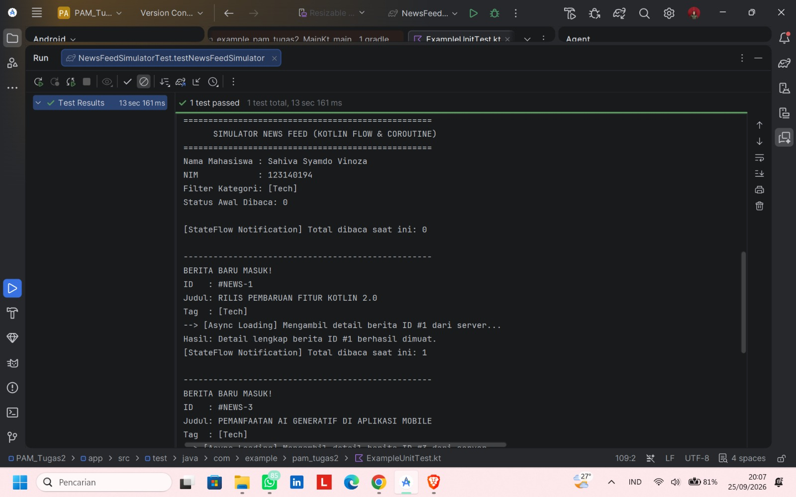
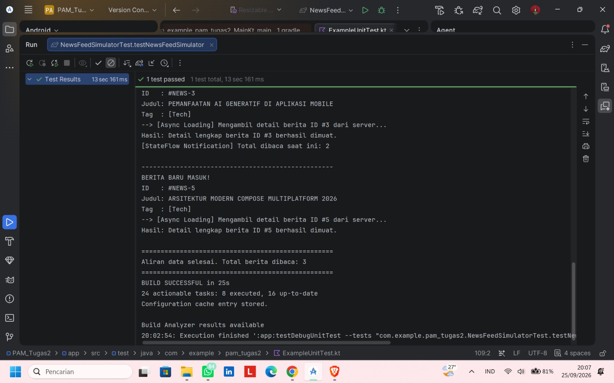

# Tugas Praktikum Pengembangan Aplikasi Mobile - Minggu 2
## News Feed Simulator

- **Nama:** Sahiva Syamdo Vinoza
- **NIM:** 123140194
- **Kelas:** RA

---

### Penjelasan Fitur Program
1. **Flow Stream (2 Detik):** Menggunakan pembangun `flow { ... }` dengan `delay(2000)` untuk mensimulasikan aliran data berita baru secara berkala.
2. **Filter Kategori:** Menggunakan operator `.filter { ... }` untuk menyaring berita agar hanya memproses berita kategori `Tech`.
3. **Transform Data:** Menggunakan operator `.map { ... }` untuk mentransformasikan data mentah `NewsItem` ke dalam format siap tampil `FormattedNews` dengan judul berhuruf kapital.
4. **StateFlow Counter:** Menggunakan `MutableStateFlow` untuk mencatat dan memancarkan total jumlah berita yang telah dibaca secara reaktif ke coroutine pemantau.
5. **Async Detail Fetching:** Menggunakan blok coroutine `async` dan `await` untuk mensimulasikan pemuatan detail isi berita secara asynchronous.

---

### Cara Menjalankan
1. Buka proyek ini di Android Studio.
2. Buka file `app/src/test/java/com/example/pam_tugas2/ExampleUnitTest.kt`.
3. Klik ikon segitiga hijau (**▶▶**) pada baris `fun testNewsFeedSimulator()`[cite: 18].
4. Hasil eksekusi log akan muncul di tab panel **Run**[cite: 18].

---

### Bukti Eksekusi Program

| Bukti 1: Aliran Berita & Filter Tech | Bukti 2: StateFlow & Selesai Eksekusi |
| :---: | :---: |
|  |  |
